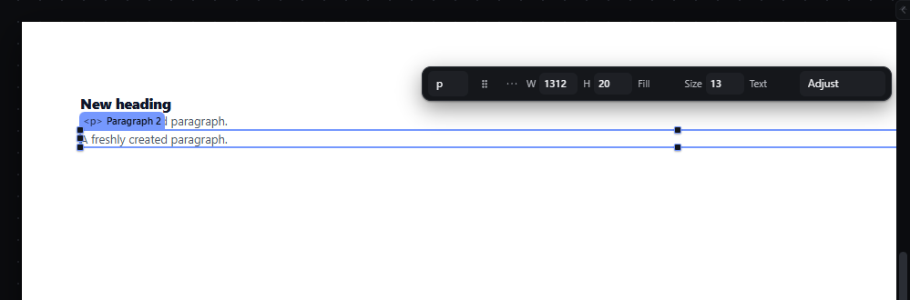
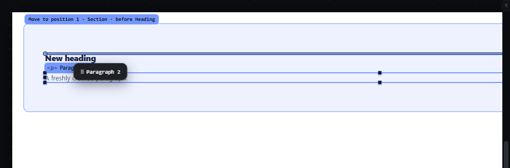
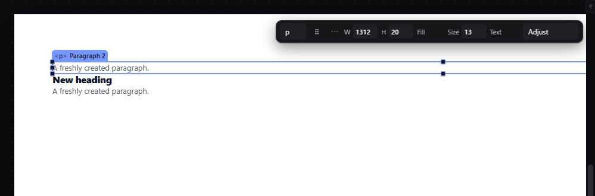
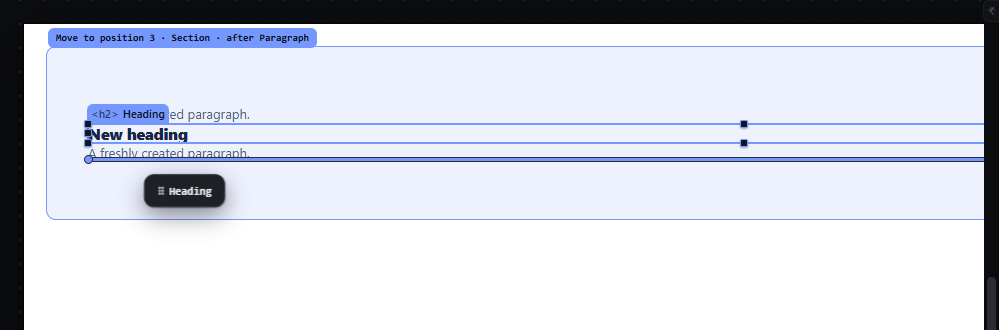
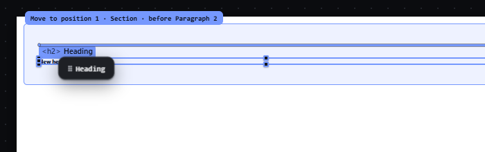

# drag-reorder-canvas — Drag an element before or after a sibling on the canvas

How Pager behaves, observed by running it from `.cache/pager-run` (Chrome, window 1600×900, zoom 100 % unless stated) and read from its source. Source references are `path:line` inside Pager. Test document: a Section (padding 56 px 40 px) holding a Heading and two Paragraphs.

## Trigger

1. Primary-button press on an element (or on its selection/hover chip) arms the gesture: the element is selected and a pending drag is stored with the press point (`src/app/boot.js:449-502`, `dragArm` at `:497`, pointer captured at `:501`).
2. The drag starts on the first `pointermove` whose distance from the press point is at least **4 px** (Euclidean, screen pixels; `src/core/pointer.js:3`, check at `src/app/boot.js:507`). Below that nothing is drawn and release is a plain click that only selects (observed: press + 3 px + release left the document JSON unchanged and the element selected).
3. While dragging, a `requestAnimationFrame` loop resolves one drop proposal per frame from the pointer position (`src/features/drag/drag.js:945-997`).
4. Release commits exactly the last proposal that was drawn (`drag.js:1118-1245`); `Escape` or a lost pointer capture cancels (`drag.js:1304-1321`, `src/app/boot.js:540-554`).

## Hit zones and thresholds

The target is the deepest element under the pointer, skipping the dragged element, its descendants and locked elements (`drag.js:395-412`). For a target inside a parent whose flow runs on axis *A* (vertical for block and column flex, horizontal for row flex), with the target's extent *S* along *A* and the pointer at offset *pos* from its start (`drag.js:238-260`, `src/platform/overlay.js:15-21`, limits in `src/platform/measure.js:40-49`):

| Target | Edge band *e* | Pointer in band | Else |
|---|---|---|---|
| Leaf (text, image, input…) | *S*/2 | first half → **before** it, second half → **after** it | — (a leaf is never a receiver) |
| Empty container | min(8, 0.25·*S*) | before / after | **inside** as first child |
| Container with children | min(clamp(0.25·*S*, 8, 32), 0.4·*S*) | before / after | **inside**, at the slot nearest the pointer |

- Measured on the Paragraph (19.5 px tall): pointer 1 px above its middle → `before Paragraph`, 1 px below → `after Paragraph`.
- Measured on the Section (151 px tall, two paragraphs): top 0-31 px → before Section; 40 px (padding) → inside at index 0; over a child → that child's halves; 111 px (bottom padding) → inside at the end; last 32 px → after Section.
- Inside a container the insertion slot is the number of children whose centre lies before the pointer on axis *A* (`src/model/layout.js:12-39`); in wrapping and grid flows the row is chosen first, then the position within it.
- Escape ladder: when the pointer is within `min(12, extent/2 − 8)` px (plus 2 px slop) of an ancestor's real edge along its parent's axis, the proposal climbs to before/after that ancestor; the outermost matching ancestor wins (`drag.js:163-211`, `:506-526`). For a small container the band shrinks: on a 19.5 px container it is 1.75 px.
- Hysteresis: a new decision replaces the drawn one only after the pointer has moved **4 px** from where the drawn one was taken (`drag.js:975-985`, `HYST:4`).
- Lateral wrapper: see `wrap-row-column` for the side bands (≤ 26 px) that offer "create a row/column" instead of a reorder.
- Autoscroll: within **56 px** of a scroll container's edge the view scrolls by up to **22 px per frame**, only after the pointer has once been more than 56 px inside the stage (`drag.js:1054-1080`, `SCROLL_ZONE:56`, `SCROLL_MAX:22`).
- A proposal whose line lies outside the visible stage (tolerance 8 px) is drawn in the warning colour with arrow heads and is refused on release with "Not committed — the destination was outside the visible stage…" (`overlay.js:64-68`, `drag.js:1126-1130`).

## Visual feedback

| Stage | What is drawn | Image |
|---|---|---|
| Pressed, under 4 px | Nothing new: the element is selected, no ghost, no line. |  |
| Dragging over the upper half of the Heading | **Insertion line**: 3 px accent line across the receiver's content width at the gap (`overlay.js:188-196`, `:276-280`), with round end caps. **Receiver tint**: the receiving parent's box (+2 px each side) gets a 1.5 px accent outline and a soft accent fill (`style/06-canvas-chrome.css:88`). **Label chip** at the receiver box's top-left, 20 px above it, clamped inside the stage (`overlay.js:283-294`): `Move to position 1 · Section · before Heading`. **Ghost chip** `⠿ Paragraph 2` follows the pointer at +14, +16 px (`drag.js:937`, `style/03-shell.css:44`). The source element keeps its place and gets a 2 px dashed accent outline (`style/06-canvas-chrome.css:30`). Cursor `grabbing`. The status bar reads `Before Heading`. |  |
| Dropped | The element moves; it flashes for 0.9 s (`drag.js:1237`) and stays selected; the status bar reads `✓ Move to position 1 · Section · before Heading`. |  |
| Over the lower half of the last Paragraph | Line below it; label `Move to position 3 · Section · after Paragraph`. |  |

Label grammar (`overlay.js:311-330`): `Move to position N · <receiver name> · before|after <sibling name>`, with ` · escape` when the ladder climbed and ` · ↑N` when the level was forced with the arrow keys. N is 1-based among the siblings without the dragged element.

## Result in the document

On release the dragged node is removed from its parent and inserted at the proposal's `(parent, index)` (`drag.js:1162-1226`). Observed: dragging Paragraph 2 over the upper half of the Heading turned `[Heading, Paragraph, Paragraph 2]` into `[Paragraph 2, Heading, Paragraph]`; dragging the Heading over the lower half of the last Paragraph gave `[Paragraph 2, Paragraph, Heading]`. The dropped element is selected. A drop that lands where the element already is leaves the document JSON identical and adds no history entry (observed: the next `Ctrl+Z` undid the command before the drag).

## Undo and redo

Each drop is one transaction (`runEditorOperation`, `drag.js:1158`): one `Ctrl+Z` restored the previous order exactly, `Ctrl+Shift+Z` re-applied it (history counter +1 per drop, observed).

## Nested elements

The receiver is always the parent of the sibling under the pointer. Near a nested container's edge the escape ladder offers the outer level; the arrow keys change the level explicitly (see `drag-level-keys-escape`).

## Zoom other than 100 %

At 50 % the same gesture produced the same proposal (`before Paragraph 2` in the Section) and the same document result. Zones are computed from measured screen boxes, so bands in CSS px scale with the zoom while the 4 px threshold, the 4 px hysteresis and the 12 px escape band stay in screen px. Chips (label, ghost) keep their screen size. 

## Keyboard equivalent

`M` takes the selection into the hand and the arrow keys aim (see `hand-keyboard-move`); `Alt+ArrowUp`/`Alt+ArrowDown` move among siblings (see `move-up-down`).

## Problems in Pager

1. **The selection chrome stays on during the drag.** The dragged element keeps its selection outline, its eight handles and its tag chip, which sit under the ghost and next to the insertion line (visible in `drag-reorder-canvas--02-before-heading.png`). Required: while a drag is live, hide the selection handles, the tag chip and the quick panel; keep only the dashed source outline.
2. **The status texts disagree about the index.** The label says `Move to position 3`, the read-out says `Sibling in Section · index 2 of 2` (0-based, counted without the dragged node). Required: one wording everywhere, 1-based, e.g. `Position 3 of 3 in Section, after Paragraph`.
3. **The label chip is anchored to the receiver's top-left corner,** far from the pointer and the line when the receiver is tall. Required: the label stays next to the insertion line (or the pointer), inside the canvas viewport.
4. **The escape band collapses on small containers** (1.75 px on a 19.5 px container), so the outer level is practically unreachable by pointer there. Required: the level can always be changed with ArrowUp/ArrowDown during the drag, and the drop indicator names the level; the escape band is at least 6 px wherever the container is at least 12 px tall.
5. **A container's flow was read along one axis only** (the user's real-use audit, item 2.1): a grid was taken for a vertical column, a wrapping flex for one line, row-reverse and column-reverse were ignored and inline children were stacked; in a grid of three cards the second and third empty cells and the gap between cards 1 and 2 proposed position 1, and a card's side edge nested into it. Required: the insertion point is the one nearest the pointer by the real boxes, in two dimensions: the line (row, or column in a column flow) the pointer is on, then its place along that line in the order shown, turned into the document's order (reverse included); a grid flows along its auto-flow (rows: along x), a flex along its direction, any other container along x when every child is inline-level; the halves of a leaf and the bands of a container are taken along that flow, before and after as shown; the insertion line stands between the neighbours shown side by side (a neighbour on another line is none). In a grid of 3 columns, a drop in the gap between cards 1 and 2 lands at index 1, and one in the third, empty cell at index 2. Where the drop is before or after an ancestor of an element offering a side drop (the ancestor's escape band: a card's side edge in a grid, whose title fills it), the drop wins and no side drop is offered.
6. **Small targets were unreachable at small zooms** (the user's real-use audit, item 2.2): the Hero's row of buttons measured 12 screen px at the "fit" zoom and all of it was the row's escape band, so a drop over a button sent the element out of the row; the container bands were taken in CSS px and shrank with the zoom. Required: the edge bands of a container (the table above, and drag-drop-inside's empty container) are taken in screen pixels from the target's extent on the screen, so they keep their size at any zoom; an ancestor's escape band is at most a third of that ancestor's extent on each side (slop included; this caps the 6 px floor of item 4 on an ancestor shorter than 24 px on the screen); over a child of a flex or a grid the drop stays in that flex or grid, before or after the child by its halves, and never climbs the escape ladder (the level keys of drag-level-keys-escape still climb). Where an ancestor shares an edge with the ancestor inside it (a card whose top is its grid's), its band at that edge is never wider than the inner one's, so the innermost wins there (the user's real-use audit, item 3.3: a drop on a card's title at the fit zoom went before the grid). At the "fit" zoom a Link tile dropped on the centre of a Link in a flex row lands in the row beside it.
7. **The indicator looked like the selection** (the user's real-use audit, item 3.1): the insertion line was 2 px in the selection's colour, and the dragged element kept its lit selection outline. Required: the line is a bar --size-drop-line (3 px) thick in its own colour, --color-canvas-drop, never the selection's, with a round mark at each end; the receiving parent is outlined with a soft fill in the target colour; while an element is dragged its selection is off (a thin neutral dashed outline marks the source; no label, no handles); the drop label never lies under the ghost chip: a place the chip covers is not free, and with none free the label moves beside the chip. The label also never covers page content (the real-use audit of the canvas, 2026-09-28: "after Title" between two blocks of text put the label over the paragraph): the three places of the label rule are tried at the line's start and at its far end, and where none is free the place covering the least content wins.
8. **A lost release left a gesture open** (the user's real-use audit, A3.14): a handle's drag whose release never arrived stayed open, and the next drag threw "this gesture is closed" and recorded both. Required: once a gesture opens (past the drag threshold) its pointer is captured, so its moves and its release arrive wherever it goes; a cancelled pointer (pointercancel), a capture lost before the release, and a press while a gesture is still open end every open gesture with nothing recorded and no exception; with the focus in the canvas frame, a press on the canvas brings the focus back to the editor, so Escape and the level keys reach the gesture, and a focus that moves into the frame during a gesture ends it (the editor window's blur) with nothing recorded.
9. **Where the drop lands had to stay still under a resting hand** (the user's real-use audit, item 3.2, as the user corrected it on 2026-09-27: a preview that opened room in the page made the neighbours move under the resting pointer, flickered and made a place between elements impossible to hit, and a dashed overlay of the dropped size only got in the way). Required: no preview of the dropped element, neither in the page nor over it: the insertion line (item 7) says where the drop lands; while a drag goes on the page never moves and the document does not change, and the dragged element keeps its place; Escape takes every mark of the drag away. A pointer that rests between two elements, trembling a few pixels as a hand does, keeps one proposal, and the release lands where the line was drawn.
10. **The label counted positions and did not say where in words** (the user's real-use audit, item 3.3). Required: the drop label and the status bar read the same words for every drag, an element's or a tile's: the neighbours the drop lands between and the path to the receiver, "Between Card 1 and Card 2 · … › Plans › Grid", "Before <first>", "After <last>", "Inside <path>" into an empty one (a tile: "Insert Paragraph · between …"), with "· ↑N" when a level key climbed; the path names the receiver and at most two of its ancestors, the outer ones left out as "…". While a drag goes on, the canvas toolbar shows its keys: "↑↓ level · Esc cancels · Alt duplicates" (spec drag-duplicate). This replaces the "position N of M" wording of item 2 and of palette-drag-insert, Problems in Pager 1.
11. **Dragging one element of a selection of several moved only it** (the user's real-use audit, item 3.4): with two headings selected, dragging one moved it alone and left it the only one selected. Required (DESIGN.md "Canvas", drag): a plain press on an element that belongs to a selection of several keeps the selection until the release; a drag from it drags the whole selection (its roots, in document order), in one undo step; a release without a drag selects that element alone, as a click does.
12. **A press inside a selected container dragged the child** (the user's real-use audit, item 3.5): with a card selected, a drag started on its title moved the title. Required: a plain press inside a selected element other than the page root keeps the selection until the release; past the drag threshold it drags the selected element; a release without a drag selects what was pressed, as a click does (a click on a card's title with the card selected selects the title).
