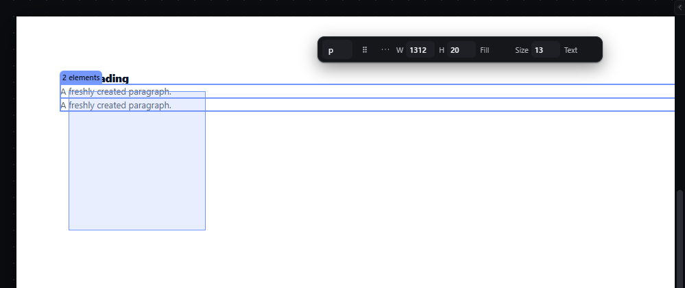
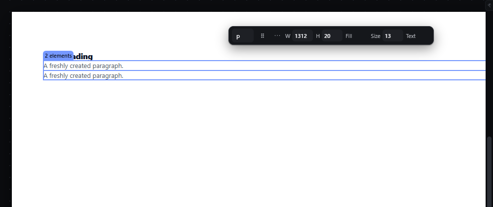

# marquee-select — Select elements by dragging a marquee on the page

How Pager behaves, observed by running it from `.cache/pager-run` (Chrome, window 1600×900, zoom 100 %) and read from its source. Source references are `path:line` inside Pager. Test document: Section (padding 56 px 40 px) > [Heading, Paragraph, Paragraph 2]; the page is 640 px tall, so there is empty page area below the Section.

## Trigger

- Primary-button press on the **Page root** (empty page area) or on the stage/overlay outside the page, captured before any other handler (`src/features/marquee/index.js:63-78`, listener in capture phase `:211`). Not in preview, not while the pan tool or Space is armed, not on handles, chips or the selection bar.
- A press on any other element (including a Section's padding) is that element's gesture (select/drag), never a marquee (`marquee/index.js:72-75`). Observed: press on a Paragraph + 30 px move started a drag (`dragging`), no band.
- The band appears after **4 px** of movement in screen pixels (`:118-124`, `DRAG_THRESHOLD_PX`).
- Modifiers read at press time: Shift = add, Ctrl/Cmd = toggle, none = replace (`:58`). Alt, held while the band is drawn, takes the leaves (Problems in Pager 3).
- `Escape`, `pointercancel`, a lost capture or window blur cancel and restore the selection held at the press (`:156-169`).

## Hit zones and thresholds

- Candidates: every descendant of the Page that is not locked or hidden, measured once at the press (`:79-98`).
- Leaf elements are taken when the band **touches** them (any overlap); containers only when the band **contains** them entirely; a taken element whose ancestor is also taken is dropped (`:127-130`, `src/platform/box-geometry.js:179-203`).
- The selection is recomputed on every move from the same starting selection (`box-geometry.js:216-228`), so it follows the band live.

## Our rules (Problems in Pager 3 and 4)

- The band takes the **direct children of the container where it started**, each one the band touches (containers and leaves alike, any overlap). The container where it started is the one whose own area the press hit — the deepest element under the press point that is not a child of another; a band pressed on the page root's empty area works over the page's children.
- **Shift + press on an element** (not the page root) starts a band over that element's siblings: the children of its parent, the pressed element included when the band touches it. This is the way to band a grid full of cards, where no empty area of the grid is pressable.
- **Alt**, held while the band is drawn, takes the leaves instead: every leaf (an element whose content is not children) the band touches, a container only when the band contains it entirely, and a taken element replaces its descendants.
- An element that is locked, or inside a locked one, or hidden, is never taken; the ones the band hit are counted in the status bar ("{count} elements selected, {skipped} locked or hidden left out.").

## Visual feedback

| Stage | What is drawn | Image |
|---|---|---|
| Dragging from empty page area up over the two Paragraphs | A band with a 1 px accent border and a 16 % accent fill (`style/06-canvas-chrome.css:481`); the touched elements are already selected (union outline, chip `2 elements`). |  |
| Released | The band disappears; status `2 elements selected.` (`canvas.marquee.took`). |  |

## Result in the document

Selection only. Observed:

| Gesture | Selection | Status |
|---|---|---|
| band from (600,400) to the Paragraph's middle | Paragraph, Paragraph 2 | `2 elements selected.` |
| Shift + band over Paragraph 2 | Paragraph, Paragraph 2 (already in) | `2 elements selected.` |
| Ctrl + band touching Heading, Paragraph, Paragraph 2 | Heading (the two paragraphs toggled out) | `1 element selected.` |
| band covering all three but not the whole Section | Heading, Paragraph, Paragraph 2 (Section not contained) | `3 elements selected.` |
| band + Escape | the selection before the press | `Cancelled — nothing changed.` |
| press and release without moving | the Page root | — |

## Undo and redo

Not undo steps.

## Nested elements

A press on the empty area of any container starts a marquee inside it (Problems in Pager 1), and a Shift+press on a nested element starts one over its siblings (Problems in Pager 4); the band takes one level at a time, descended with Alt (Problems in Pager 3).

## Zoom other than 100 %

The 4 px threshold is in screen px (`marquee/index.js:119-120`); element boxes are measured on the zoomed canvas.

## Keyboard equivalent

`Ctrl+A` is covered by `select-container-children.md` (not bound in Pager).

## Problems in Pager

1. **A marquee cannot start inside a container,** e.g. in a tall Section's empty padding. Required: a press on the empty area of any container (not on a child) starts a marquee limited to that container's descendants when the pointer moves 4 px; without movement it selects the container. Elements that contain the start point are never taken (manifest feature `marquee-select`).
2. **A press without movement on the stage outside the page selects the Page root** (the marquee path). Required: it clears the selection (see `select-click.md`).
3. **A band takes leaves, never the containers they sit in.** Observed in a grid full of cards: starting in the Section's padding and dragging over two cards selects the Image and the Heading inside each card, not the cards (user's real-use audit, item 3.7). Required: the band takes the direct children of the container where it started, each one the band touches; Alt takes the leaves instead. And an element that is locked or hidden is left out, with the count in the status bar.
4. **A grid full of cards leaves no place to start a band,** and a press on a card is that card's gesture. Required: Shift + press on an element starts a band over its siblings, the children of its parent.
