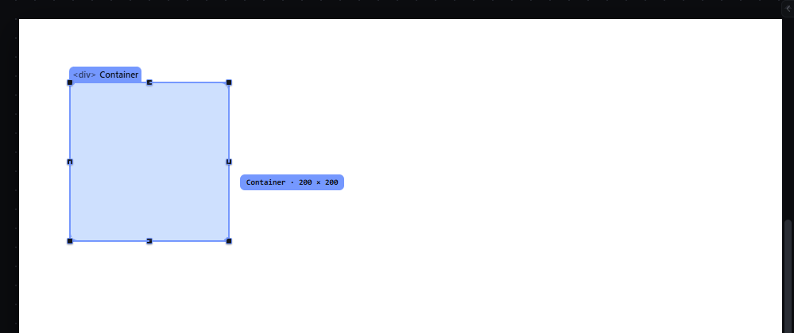
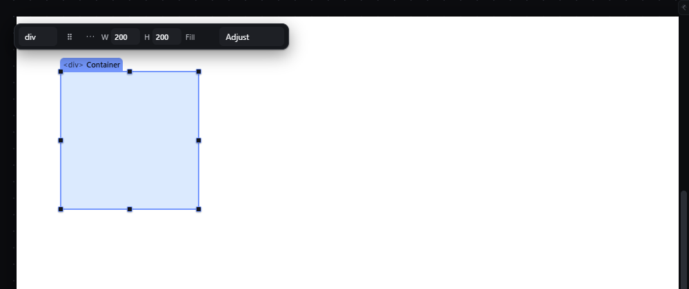
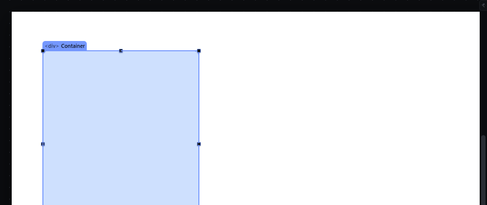
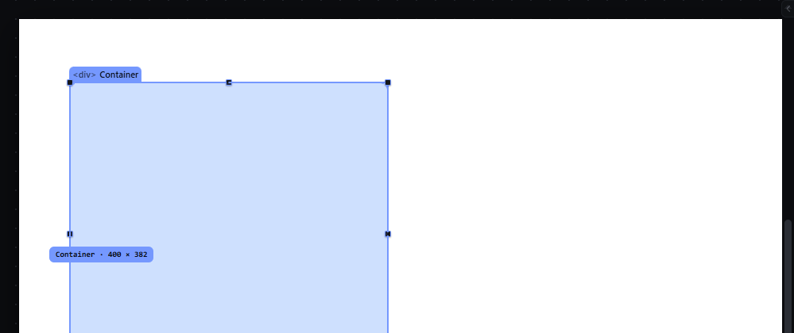
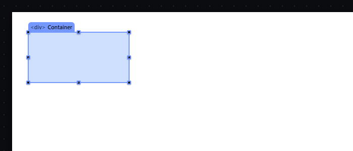

# resize-handles — Resize an element with its eight handles

How Pager behaves, observed by running it from `.cache/pager-run` (Chrome, window 1600×900) and read from its source. Source references are `path:line` inside Pager. Test document: Section > Container (`width: 300px; height: 200px`, light background), selected.

## Trigger

- Primary-button press on one of the eight handles drawn on the selection outline (`nw n ne e se s sw w`, `src/features/resize/index.js:45`, `:339-350`), with exactly one element selected that is not locked or hidden (`:102-106`).
- The resize starts after **4 px** of movement (screen px, `:123`); release before that does nothing.
- Modifiers are read on every move (`src/features/drag/drag.js:307-311`): **Shift** keeps the aspect ratio, **Alt** resizes symmetrically, **Ctrl** suspends snapping.
- `Escape`, `pointercancel`, lost capture, window blur, or any document change cancel (`resize/index.js:208-231`).

## Hit zones and thresholds

- Each handle is an 8 × 8 px circle (`--handle: 8px`, `style/02-tokens.css:230`) centred on the corner or edge centre; it is inverse-scaled so it keeps 8 screen px at any zoom (`style/06-canvas-chrome.css:159`). When the element is smaller than 48 px on either axis the outline gets `compact-handles` (`resize/index.js:377`).
- Handles are hidden for multi-selections, locked, hidden or "borrowed" (zero-size) selections (`:372-378`).
- Size change in CSS px = pointer movement in screen px ÷ zoom (`:129-146`, `a.scale`). Measured at 50 %: dragging the E handle 50 screen px to the right changed `width` from 300 px to 400 px.
- Minimum box: 8 px on each axis (`BOX_MIN_PX`, `src/platform/box-geometry.js:5`).
- Snapping (only when Snap is on): edges within the snap distance (default 6 px, times the zoom) of targets jump to them (`box-geometry.js:125-137`, see `snap-while-moving.md`).
- Written values are `width`/`height` in px, corrected for padding and border when `box-sizing` is `content-box` (`resize/index.js:139-147`), and corrected so a flow element's visible edge follows the pointer (`:151-174`).

## Visual feedback

| Stage | What is drawn | Image |
|---|---|---|
| Dragging the E handle 100 px left | The element is previewed live at its new size (temporary inline declarations, never in the document, `:148-149`); the selection outline follows; a label chip next to the pointer reads `Container · 200 × 200` (`src/platform/overlay.js:284`, `:316`). The status bar reads `Coordinates (0, 0)` during the drag. |  |
| Released | Status `Resized to 200 × 200.` |  |
| SE with Shift | Proportional: the label follows the constrained size. |  |
| W with Alt | Symmetric change (see Result). |  |
| At 50 % zoom | Same chrome; handles keep 8 screen px. |  |

## Result in the document

Observed sequence (all values from the document JSON):

| Gesture | width × height |
|---|---|
| start | 300px × 200px |
| E handle −100 px | 200px × 200px |
| S handle +80 px | 200px × 280px |
| SE handle +60, +30 | 260px × 310px |
| SE handle +60, +10 with Shift | 320px × **381.54px** (aspect kept, fractional px written) |
| W handle −40 px with Alt | 400px × 381.54px (width grew by 80; the left edge stayed where it was because the element is in flow) |
| Escape during an E drag | unchanged; status `Cancelled — nothing changed.` |

Each resize writes only `width` and/or `height` on the active breakpoint and state layer (`:232-251`). Positioned (absolute/fixed) elements also get their offsets rewritten so the opposite edge stays put (`:175-183`).

## Undo and redo

One history entry per resize: Ctrl+Z after the Alt resize restored `320px × 381.54px` (observed).

## Nested elements

Only the selected element is resized; its children reflow.

## Zoom other than 100 %

The CSS change is the pointer movement divided by the zoom (observed at 50 %); handles and label keep their screen size.

## Keyboard equivalent

None for resizing in Pager (the Size fields in the Inspector and quick panel are the typed route).

## Our rule: the dragged edge follows the pointer, and the parent bounds the box (the user's real-use audit, items 4.2 and A3.16)

- **A start-edge drag moves the edge, not the size.** A west or north handle moves the edge the pointer holds and keeps
  the opposite one where it was: a block-level element in the flow compensates with its own margin (a Title 1344 px
  wide shrunk to 1200 on its west handle gets `margin-left: 144px`, and its right edge does not move), a positioned
  element with its left/top, and a shape of an SVG with its geometry attributes. The element keeps its own start edge
  only where the parent lays it out — a flex or a grid item, an inline-level element — and there the handles that carry
  a start edge (north, west, and the corners that include them) are drawn disabled, faint, with the reason on their
  tooltip (`canvas.resize.parentPlaces`, "the parent places this element"); a press on one is not a resize, so what
  lies under it (the element itself) takes the press.
- **The width stops where the space its parent gives it ends** (A3.16): the parent's content box, or, for a grid item,
  the cell its own box touches (the tracks the browser resolved). A card 200 px wide in a three-column grid of 448 px
  tracks dragged east stops at 448 px, whatever the pointer asks. Only the width is bounded: a page grows downwards
  with its content, so a height is never capped.
- **A medium keeps its own ratio by default, and Shift releases it** (A3.16). The ratio is the element's intrinsic one
  where the page knows it (an image's own size), else its box's; a corner drag follows the side the pointer pulled
  further, an edge drag carries the other dimension. Every other element keeps its ratio only while Shift is held, as
  before. The `resize` gesture's modifier is declared once, as `toggle-aspect-ratio` (interactions.json).
- **The label carries the element's own size** (`canvas.measure.size`, `data-chrome="label-size"`), live while a resize
  goes on, and **it never covers a handle** (A3.16): it stands a handle's half above the element's top edge, so the
  north, north-west and north-east handles stay takeable.

The scenarios of this feature say the above: `the-west-handle-moves-the-left-edge-and-keeps-the-right-one`,
`the-north-handle-moves-the-top-edge-and-keeps-the-bottom-one`, `a-north-east-corner-handle-moves-the-top-edge`,
`a-south-west-corner-handle-moves-the-left-edge`, `a-north-west-corner-handle-moves-both-start-edges` and
`the-east-handle-stops-at-the-grid-cells-edge`. The three older scenarios (an edge handle, a top or bottom handle, a
corner handle) keep their own end-edge doors, whose diffs are unchanged.

## Problems in Pager

1. **The status bar shows `Coordinates (0, 0)` while resizing.** Required: the status bar shows the live size `W × H` during the drag and `Resized to W × H` at the end (manifest feature `resize-handles`).
2. **Shift writes fractional pixels** (`381.54px`). Required: resize results are rounded to whole CSS px (the aspect ratio is kept to the nearest pixel).
3. **Alt on a flow element doubles the change on one side instead of resizing around the centre.** Required: Alt resizes symmetrically around the centre; for an element whose left edge cannot move in its flow, the status explains that the change is applied to the width (`Width changed on both sides by N px`), and the preview shows the true result.
4. **The resize modifiers had two readings:** the old `snap-while-moving` entry gave Alt the snap switch while `resize-handles` gave Alt the symmetric resize, so Alt would have meant two things in one gesture (report PG-14). Required, one meaning per modifier: during a resize **Shift** keeps the aspect ratio, **Alt** resizes from the centre, and **Ctrl** suspends snapping for that gesture. The modifiers are declared once, in the `resize` gesture of `manifest/interactions.json`.
5. **Handles are 8 px circles,** hard to hit. Required: handles have the minimum target size given in `DESIGN.md`, and a hover state.
- **The handles covered small elements** (the user's real use, 2026-09-27): at the fit zoom a link measures about 23 × 10 screen pixels, its eight 12 px handles cover all of it, and a press on it resized it instead of dragging it. Required: a handle is drawn only where it has room (interactions.json resize.handleRoom): the top and bottom handles where the element is at least that tall on the screen, the sides where it is that wide, a corner where it is both; a press on the rest of the element drags it.
- **The handles of a selected element covered its neighbour** (the canvas audit of 2026-09-28): with a card selected, its south handle's hit area stood wholly outside its bottom edge — over the card drawn right below it, 23 screen pixels tall — so a press meant to drag that card resized the one above (or cleared the selection), and the neighbour could not be taken at all while the element above stayed selected. Required: a handle's hit area never covers a neighbouring element (a sibling's box); the room the neighbour leaves outside is all the handle keeps, the rest of its square moves inside the selected element, its dot stays on the element's own edge, and a press there still resizes.
