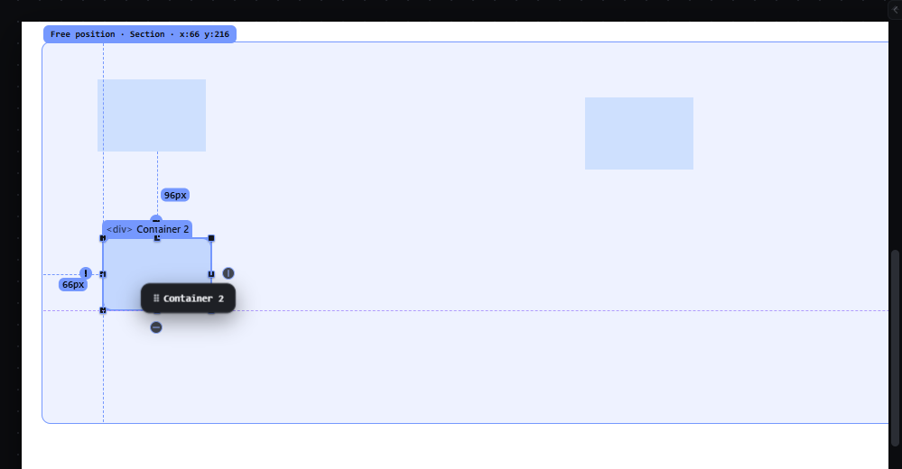

# snap-while-moving — Snapping while resizing and moving positioned elements

How Pager behaves, observed by running it from `.cache/pager-run` (Chrome, window 1600×900, zoom 100 %, Snap: On, default settings) and read from its source. Source references are `path:line` inside Pager. Test document: Section (`position: relative; height: 420px`) with three absolute 120 × 80 px Containers at (60, 40), (300, 200) and (600, 60).

## Trigger

Snapping applies during: free drags of positioned elements (`src/features/drag/drag.js:689-692`), resize handles (`src/features/resize/index.js:129-131`), guide drags (`src/features/rulers/index.js:309`) and property handles/bands (`src/features/spacing/handles.js:26-39`). Snap must be on (`snap-toggle-settings.md`). **Ctrl** suspends it for the gesture (`drag.js:689`, `resize/index.js:130`); **Alt does not** (observed: an Alt drag still snapped to the same ruler target).

## Hit zones and thresholds

- Radius: the snap distance (default **6 px**) × zoom, in screen px (`drag.js:689`).
- Target lists per axis (`src/platform/box-geometry.js:20-40`), each switchable in Snap settings: siblings' edges and centres (Elements, Edges, Centers), the parent's edges and centre (Parent), the page's edges and centre (Page), manual guides (Guides), grid lines (Grid), and **every ruler tick** (Rulers) — the ruler step is the smallest of 1, 2, 5, 10, 25… px whose screen size is ≥ 6 px (`rulers/index.js:35-39`, `:68-72`), i.e. every 10 CSS px at 100 %.
- For a move, the box's left, centre and right (top, middle, bottom) are tested; the nearest target within the radius wins per axis (`box-geometry.js:46-55`, `:108-122`). For a resize, only the dragged edges are tested (`:125-137`).
- Equal spacing: after edge snapping, if an axis did not snap, the box is pulled to repeat a gap between two siblings, within 1.5 × the radius (`box-geometry.js:57-83`).

## Visual feedback

| Stage | What is drawn | Image |
|---|---|---|
| Container 2 dragged so its left edge passes 4 px from Container 1's left edge | The box jumped to a **ruler tick** (x = 66, 2 px away) rather than to Container 1's left edge (4 px away); a dashed vertical line is drawn across the receiver at the snapped x (`gd v ruler`), a dashed horizontal line at a centre alignment (`gd h ctr`, violet for centres, `style/06-canvas-chrome.css:104-110`); distance markers `96px` and `66px` show the gaps to the thing above and to the left. |  |

## Result in the document

The stored value is exactly the snapped position: `left: 66px; top: 216px` (observed). With Ctrl held the proposal did not snap (`gx: null`) — and Ctrl also turned the drag into a duplicate (a copy `Container 2` copy was inserted; undone).

## Undo and redo

Snapping is part of the gesture; the gesture is one history entry.

## Nested elements

Targets are the dragged element's siblings, its parent and the page; not cousins.

## Zoom other than 100 %

The radius and the ruler step are recomputed from the zoom, so the snap feels the same in screen px.

## Keyboard equivalent

Nudges never snap.

## Our rule: the line, its colour and its measure (the user's real-use audit, item 4.5, and A1.5)

- **The snap line is 2 px wide** (`--size-snap-line`, a token as the drop line is) **in its own colour**
  (`--color-canvas-snap`, both themes), never the target colour it shared with the column grid. It runs the whole
  alignment: from the moving box to a target with a span, and along the page side for a line that names no box (a
  guide, a column grid line, a ruler tick). It carries its **measure**: the distance the moving box stands from the
  element it aligned with (the snap offset), or the place itself for a guide or a grid line (`snap-line__value`).
- **A resize in flow draws the distances to its neighbours** (`chrome__distance`, the marks the Alt measurement uses):
  from the box being resized to the nearest sibling on each axis the handle drags, live, gone with the release — the
  same numbers Alt shows by hand, drawn by the gesture that needs them (the audit: the distances were a manual
  reading and only for absolute elements).
- **The column grid and its gutters are snap targets** (A1.5): with Snap and the column grid on, a box four page px
  from a column edge snaps onto it and the line of that edge is drawn. A ruler tick nearer than the column wins, as
  the nearest target does; the rulers are a target of their own.

## Problems in Pager

1. **Ruler ticks every 10 px act as snap targets with a 6 px radius,** so almost every position snaps to the 10 px ruler grid and element alignment loses (observed: 2 px to a tick beat 4 px to a sibling edge). Required: only enabled targets snap (manifest feature `snap-while-moving`), and when several enabled targets are within the snap distance, element edges and centres, guides, the parent and the page win over ruler ticks and grid lines; the priority order is one table in the snapping owner.
2. **Ctrl both suspends snapping and duplicates** (report PG-14). Required, one meaning per modifier: holding **Ctrl** suspends snapping for that gesture, when resizing and when moving a positioned element; Ctrl never duplicates. **Alt** keeps its one resize meaning, resizing from the centre, and does not touch snapping. The modifiers are declared once per gesture in `manifest/interactions.json` (`resize`, `free-drag`).
3. **Equal-spacing snaps are applied but never drawn** (the `eq` result is computed, `drag.js:705`, but `overlay.js` has no drawing for it). Required: see `smart-guides.md`.
4. **The snap line spans the receiver only.** Required: the snap line spans from the moving element to the target it snapped to, and the target is named or highlighted, so the person sees why it snapped.
